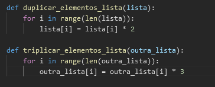
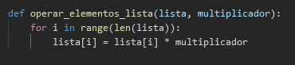

# Ausência de duplicidade

A ausência de duplicidade é uma característica crucial em projetos de software eficientes. Isso implica evitar a repetição desnecessária de código, promovendo a criação de módulos independentes, cada um responsável por uma funcionalidade específica. Um código livre de duplicidade é construído de maneira que esses módulos interajam de forma clara e coesa, facilitando a compreensão do sistema como um todo. Essa abordagem não apenas simplifica a leitura e a compreensão do código, mas também promove a reutilização de componentes em diferentes partes do projeto ou até mesmo em projetos distintos. A ausência de duplicidade torna o código mais fácil de manter, testar e modificar, contribuindo para a eficiência global do sistema. Além disso, ela favorece a colaboração entre membros da equipe, uma vez que a clareza na estrutura do código facilita a compreensão do trabalho realizado por diferentes desenvolvedores.

## Tópicos

1. Descrição e Efeitos no Código
2. Relação com Maus-Cheiros de Código
3. Operações de Refatoração
4. Referências Bibliográficas
5. Materiais de Apoio

## Descrição e Efeitos no Código

A eliminação de duplicidades, uma qualidade essencial em projetos de software, está relacionada à organização do código de forma que evite repetições desnecessárias e promova a criação de módulos independentes e interconectados. Cada módulo desempenha uma função específica, promovendo uma estrutura clara e compreensível. A ausência de duplicidade não apenas simplifica a leitura e compreensão do código, mas também facilita a manutenção, uma vez que alterações podem ser realizadas em módulos isoladamente. Além disso, essa abordagem favorece a reutilização de código em diferentes partes do projeto, melhorando a eficiência global do sistema. A colaboração entre membros da equipe é facilitada, pois a eliminação de duplicidades permite que desenvolvedores compreendam e integrem os módulos uns dos outros de maneira mais eficaz.

## Relação com Maus-Cheiros de Código

A importância da ausência de duplicidade no design de software é evidente ao considerar os maus cheiros de código, como o "Código Duplicado". A duplicação de código é um indicador claro de falta de eliminação de duplicidades, pois a ausência de módulos independentes favorece a replicação desnecessária de trechos de código. A eliminação adequada de duplicidades permite encapsular funcionalidades compartilhadas em módulos reutilizáveis, evitando a duplicação. 

## Operações de Refatoração

A técnica "Extract Method" é uma estratégia eficaz na refatoração de código para lidar com a presença de duplicação de código. Quando se identifica a repetição de lógica em diferentes partes de um método ou de métodos distintos, a aplicação do "Extract Method" torna-se uma abordagem valiosa. Essa técnica envolve isolar o bloco de código duplicado em um novo método separado e, em seguida, chamar esse método sempre que a lógica duplicada for necessária. Essa prática não apenas elimina a duplicação, mas também contribui para a legibilidade e manutenibilidade, uma vez que a lógica compartilhada é centralizada em um único local.

### Exemplo de Código Duplicado

### Exemplo de Código sem duplicidade

## Referências Bibliográficas

FOWLER, Martin. Refactoring: improving the design of existing code. Boston: Addison-Wesley Longman Publishing Co., Inc., 1999.

## Materiais de Apoio

1. [Duplicate Code](https://refactoring.guru/pt-br/smells/duplicate-code)

2. [Refactoring - Martin Fowler](https://martinfowler.com/books/refactoring.html)
