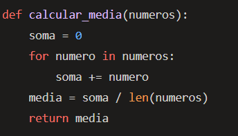

# Simplicidade no Design de Software

A simplicidade é uma das características mais importantes de um bom projeto de software. Ela se refere à facilidade com que o código pode ser lido e compreendido. Um código simples é direto, conciso e não contém elementos desnecessários ou redundantes. Ele é escrito de uma maneira que é fácil de entender, mesmo para alguém que não está familiarizado com o projeto. A simplicidade tem um impacto direto na manutenibilidade do código, pois um código mais simples é mais fácil de modificar, menos propenso a erros e mais fácil de testar. Além disso, um código simples geralmente resulta em um sistema mais eficiente, pois não há código desnecessário que possa retardar a execução do programa. A simplicidade também facilita a colaboração entre os membros da equipe, pois torna mais fácil para os desenvolvedores entenderem o trabalho uns dos outros (FOWLER, 1999).

## Tópicos

1. Descrição e Efeitos no Código
2. Relação com Maus-Cheiros de Código
3. Operações de Refatoração
4. Referências Bibliográficas
5. Materiais de Apoio

## Descrição e Efeitos no Código

A simplicidade é uma das características mais importantes de um bom projeto de software. Ela se refere à facilidade com que o código pode ser lido e compreendido. Um código simples é direto, conciso e não contém elementos desnecessários ou redundantes. Ele é escrito de uma maneira que é fácil de entender, mesmo para alguém que não está familiarizado com o projeto. A simplicidade tem um impacto direto na manutenibilidade do código, pois um código mais simples é mais fácil de modificar, menos propenso a erros e mais fácil de testar. Além disso, um código simples geralmente resulta em um sistema mais eficiente, pois não há código desnecessário que possa retardar a execução do programa. A simplicidade também facilita a colaboração entre os membros da equipe, pois torna mais fácil para os desenvolvedores entenderem o trabalho uns dos outros.

## Relação com Maus-Cheiros de Código

Os maus-cheiros de código são indicadores de problemas no projeto de software que podem tornar o código mais difícil de entender e manter. Um exemplo de mau-cheiro de código que viola a simplicidade é o “Long Method”. Métodos longos são difíceis de entender e manter, pois eles podem conter muita lógica e responsabilidades diferentes. Eles podem conter lógica duplicada e tornar o código mais complexo do que o necessário. Outro exemplo é o “Large Class”, que é uma classe que tenta fazer muitas coisas e acaba sendo grande e complicada. Essas classes são difíceis de entender e manter, e geralmente são um sinal de que a classe deve ser dividida em classes menores e mais simples. Outro mau-cheiro de código relacionado à simplicidade é o “Data Clumps”, que ocorre quando um grupo de variáveis é frequentemente usado juntas e poderia ser substituído por uma classe.

## Operações de Refatoração

A refatoração é o processo de alterar a estrutura do código sem alterar seu comportamento externo, com o objetivo de melhorar aspectos como legibilidade, simplicidade e manutenibilidade. Existem várias operações de refatoração que podem ser usadas para melhorar a simplicidade do código. Por exemplo, a refatoração “Extract Method” pode ser usada para tratar o mau-cheiro “Long Method”. Esta refatoração envolve criar um novo método a partir de um bloco de código em um método existente. Isso simplifica o método original e torna o código mais fácil de entender. Outra refatoração útil para melhorar a simplicidade é a “Extract Class”, que pode ser usada para dividir uma “Large Class” em classes menores e mais simples. A refatoração “Replace Data Clump with Object” pode ser usada para tratar o mau-cheiro “Data Clumps”, substituindo o grupo de variáveis por uma classe.

### Exemplo de Código Longo

### Exemplo de Código Curto

## Referências Bibliográficas

FOWLER, Martin. Refactoring: improving the design of existing code. Boston: Addison-Wesley Longman Publishing Co., Inc., 1999.

## Materiais de Apoio

1. [What is Simplicity?](https://www.interaction-design.org/literature/topics/simplicity) - Este artigo discute a simplicidade como uma filosofia de design e como incorporá-la em seus designs para criar melhores interfaces de usuário.

2. [Reflection of the Simplicity Design Principle to the Design](https://www.interaction-design.org/literature/topics/simplicity) - Este artigo reflete sobre o princípio de design da simplicidade e como ele se aplica ao design.

3. [Refactoring - Martin Fowler](https://martinfowler.com/books/refactoring.html) - O site de Martin Fowler, um dos principais nomes na área de refatoração de código, contém uma série de recursos úteis sobre o assunto.
